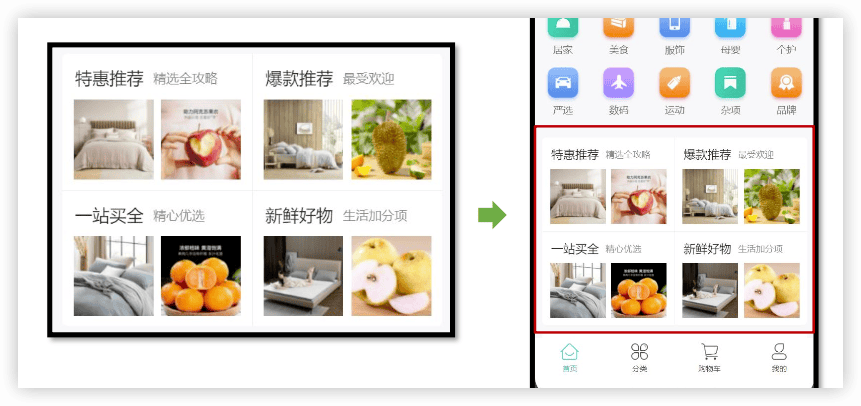
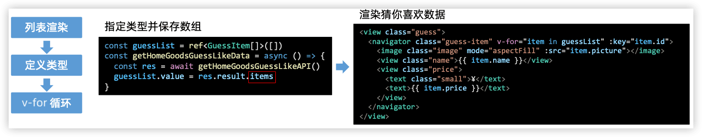
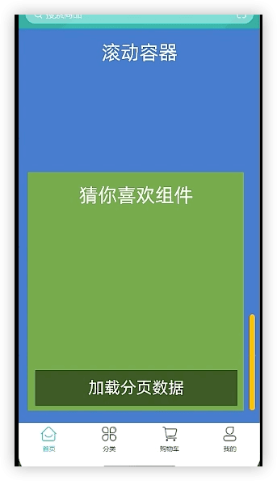
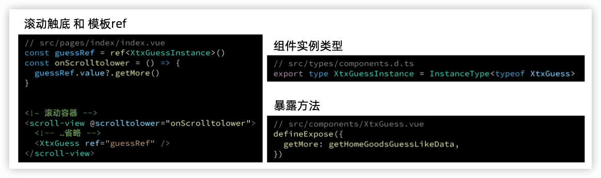
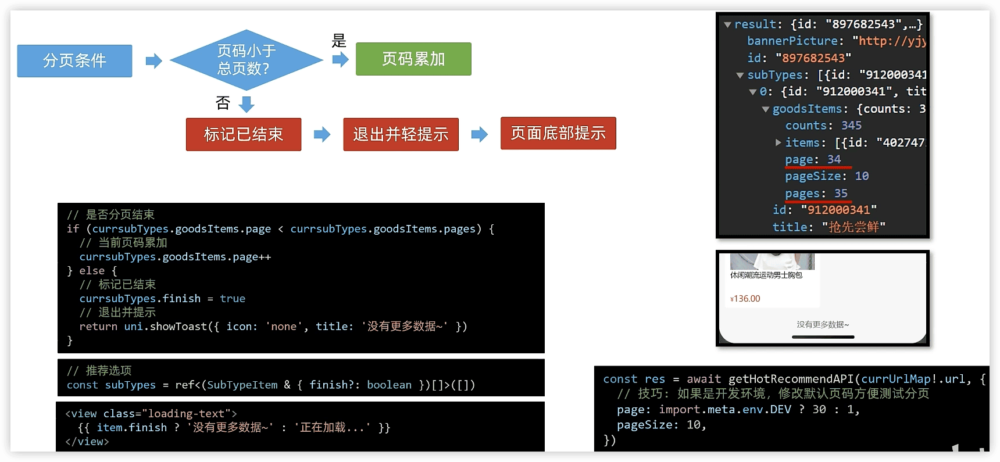
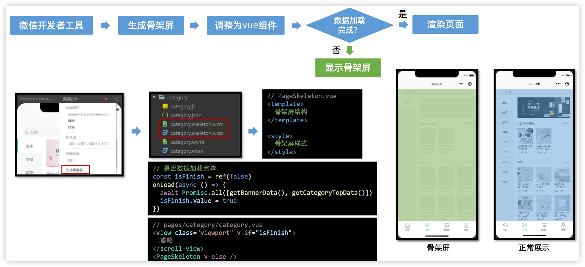
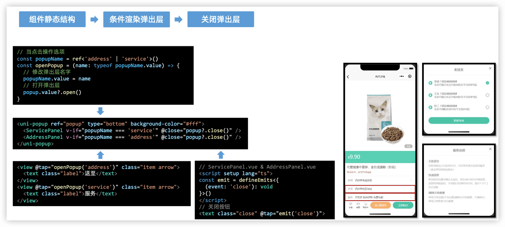

胖达儿
---

参考：https://www.bilibili.com/video/BV1Bp4y1379L

[开发前的准备](prepare.md)


胖达儿包含从首页浏览商品，商品详情，微信登录，加入购物车，提交订单，微信支付，订单管理等功能。

## 1 基础架构

```sh
git clone http://git.itcast.cn/heimaqianduan/erabbit-uni-app-vue3-ts.git  panda-shop
```

在 manifest.json 中添加微信小程序的 appid

```
pnpm install   ->   pnpm dev:mp-weixin    ->   导入微信开发者工具
```


### 工程结构解析


```
├── .husky                     # Git Hooks
├── .vscode                    # VS Code 插件 + 设置
├── dist                       # 打包文件夹（可删除重新打包）
├── src                        # 源代码
│   ├── components             # 全局组件
│   ├── composables            # 组合式函数
│   ├── pages                  # 主包页面
│       ├── index               # 首页
│       ├── category            # 分类页
│       ├── cart                # 购物车
│       ├── my                  # 我的
│       └── login               # 登录页
│   ├── services               # 所有请求
│   ├── static                 # 存放应用引用的本地静态资源的目录
│       ├── images              # 普通图片
│       └── tabs                # tabBar 图片
│   ├── stores                 # 全局 pinia store
│       ├── modules             # 模块
│       └── index.ts            # store 入口
│   ├── styles                 # 全局样式
│       └── fonts.scss          # 字体图标
│   ├── types                  # 类型声明文件
│       └── component.d.ts      # 全局组件类型声明
│   ├── utils                  # 全局方法
│   ├── App.vue                # 入口页面
│   ├── main.ts                # Vue初始化入口文件
│   ├── pages.json             # 配置页面路由等页面类信息
│   ├── manifest.json          # 配置appid等打包信息
│   └── uni.scss               # uni-app 内置的常用样式变量
├── .editorconfig              # editorconfig 配置
├── .eslintrc.cjs              # eslint 配置
├── .prettierrc.json           # prettier 配置
├── .gitignore                 # git 忽略文件
├── index.html                 # H5 端首页
├── package.json               # package.json 依赖
├── tsconfig.json              # typescript 配置
└── vite.config.ts             # vite 配置
```


### 引入uni-ui组件库

[uni-ui 介绍 | uni-app官网](https://uniapp.dcloud.net.cn/component/uniui/uni-ui.html)


安装uni-ui

```
pnpm i @dcloudio/uni-ui
```

通过正则配置uni-ui的组件自动导入：

```json
  // 组件自动引入规则
  "easycom": {
    // 是否开启自动扫描，自动扫描components目录等看是否有符合uniapp的组件
    "autoscan": true,
    // 以正则放到从依赖库中导入组件
    "custom": {
      // uni-ui 规则如下配置
      "^uni-(.*)": "@dcloudio/uni-ui/lib/uni-$1/uni-$1.vue"
    }
  }
```


`@uni-helper/uni-ui-types`作用是提供uni-ui组件类型。安装：

```
pnpm i -D @uni-helper/uni-ui-types
```

配置：

```json
    "types": [

      "@uni-helper/uni-ui-types"
    ]
```

原本：


配置后：


### 小程序端Pinia持久化

状态管理：pinia

持久化在与网页端有所不同：

```js
// 网页端API
localStorage.setItem()
localStorage.getItem()

// 小程序端API
wx.setStorageSync()
wx.getStorageSync()

// 兼容多端API
uni.setStorageSync()
uni.getStorageSync()
```

```json
	persist: {
      storage: {
        getItem(key) {
          return uni.getStorageSync(key)
        },
        setItem(key, val) {
          uni.setStorageSync(key, val)
        },
      },
    },
```


参数的具体配置，可以查看提示中的地址：


### 数据交互（请求工具）

数据交互 -> 请求工具  -> 1️⃣拦截器， 2️⃣请求函数

#### 请求和上传文件拦截器


#### 封装Promise请求函数

目的是为了更加方便的发请求。借鉴aioxs


##### 请求成功提取数据和设置类型


##### 获取数据失败

- uni.request 的 success 回调函数只是表示服务器**响应成功，没处理响应状态码**，业务中使用不方便

- axios 函数是只有**响应状态码**是 2xx 才调用 **resolve 函数，表示获取数据成功**，业务中使用更准确


模拟网络失败


## 2 首页模块


### 2.1 自定义导航栏

1. 准备组件
2. 隐藏默认导航栏，修改文字颜色
3. 样式适配-> ==安全区域==


### 2.2 通用轮播组件

总共有两处广告位，分别位于【首页】和【商品分类页】。

轮播图组件需要在首页和分类页使用，需要封装成通用组件。

1. 准备组件
2. 自动导入组件
3. 添加组件类型声明


```json
"easycom": {
    // 是否开启自动扫描，自动扫描components目录等看是否有符合uniapp的组件
    "autoscan": true,
    // 以正则放到从依赖库中导入组件
    "custom": {
      // uni-ui 规则如下配置
      "^uni-(.*)": "@dcloudio/uni-ui/lib/uni-$1/uni-$1.vue",
      // 在通用组件文件夹中，查找以Pd开头的组件，自动导入(修改后需要重启服务器)
      "^Pd(.*)": "@/components/Pd$1.vue"
    }
  }
```

```typescript
import PdSwiper from './PdSwiper.vue'

// 定义全局类型
declare module '@vue/runtime-core' {
  export interface GlobalComponents {
    PdSwiper: typeof PdSwiper
  }
}
```


#### 轮播图指示点


知识点：
1. `UniHelper` 提供事件类型
2. `？`(可选链) 允许前面表达式为空值
3. `！`(非空断言) 主观上排除掉空值情况

#### 获取轮播图数据

1. 封装获取轮播图数据API
2. 页面初始化调用API

```js
// services/home.ts
export const getHomeBannerAPI = (distributionSite = 1) => {
  return http({
    method: 'GET',
    url: '/home/banner',
    data: {
    	distributionSite,
    },
  })
}
```

```js
// pages/index/index.vue
const getHomeBannerData = async () => {
  const res = await getHomeBannerAPI()
  console.log(res)
}
onLoad(() => {
  getHomeBannerData()
})
```


#### 定义轮播图数据类型并渲染

1. 定义轮播图数据类型  `types/home.d.ts`
2. 指定类型并传值给子组件
3. 渲染轮播图数据


#### 轮播图总结


> bug  
>
> `[plugin:uni:mp-using-component] Unexpected token C in JSON at position 33`
>
> 解决方案：https://github.com/dcloudio/uni-app/issues/4952


### 2.3 前台分类组件


1. 准备组件（只有首页使用，存放到首页的 `components` ，取名 `CategoryPanel`）
2. 导入并使用组件
3. 设置首页底色为  `#F7F7F7`  

小程序页面根标签是`<page>`，类似web种的body


#### 获取前台分类数据

1. 封装获取前台分类数据API
2. 页面初始化调用API

```ts
// services/home.ts
export const getHomeCategoryAPI = () => {
  return http({
    method: 'GET',
    url: '/home/category/mutli',
  })
}
```

```typescript
// pages/index/index.vue
const getHomeCategoryData = async () => {
  const res = await getHomeCategoryAPI()
}
onLoad(() => {
	getHomeCategoryData()
})
```


#### 前台分类数据类型并渲染

1. 定义前台分类数据类型
2. 指定类型并传值给子组件
3. 渲染前台分类数据


### 2.4 热门推荐组件

1. 准备组件(只有首页使用)
2. 导入并使用组件



#### 获取热门推荐数据

1. 封装获取热门推荐数据API
2. 页面初始化调用API

#### 热门推荐数据类型并渲染

1. 定义热门推荐数据类型
2. 指定类型并传值给子组件
3. 渲染热门推荐数据


### 2.5 猜你喜欢组件❤️

猜你喜欢功能，后端根据用户的浏览记录等信息向用户随机推荐的一系列商品，前端负责把商品在**多个页面中展示**。

1. 准备组件(通用组件) `XtxGuess`
2. 定义组件类型
3. 准备 scroll-view 滚动容器
4. 设置 page 和 scroll-view 样式


scroll view的滚动区域：


p23 8:00 `flex`属性可以智能地分配滚动的高度

#### 获取猜你喜欢数据

猜你喜欢组件在多个地方调用，因此不要在页面初始化时调用。组件挂载完后，让组件自动调用一下数据获取。

1. 封装获取猜你喜欢数据API
2. **组件挂载完毕**调用API

组件生命周期钩子之一是：“组件挂载完毕”


#### 猜你喜欢数据类型和列表渲染




#### 猜你喜欢分页准备






#### 猜你喜欢分页加载


#### 猜你喜欢分页条件


### 2.6 下拉刷新


> ```typescript
>   await getHomeBannerData()
>   await getHomeCategoryData()
>   await getHomeHotData()
> ```
>
> 
>
> 而`await Promise.all([getHomeBannerData(), getHomeCategoryData(), getHomeHotData()])` 可让三个请求同时加载，减少加载时间
>
> 

#### 下拉刷新时猜你喜欢数据获取

猜你喜欢组件是组件内发起请求数据并维护的。

下拉刷新时，猜你喜欢组件需要做：


### 2.7 骨架屏

骨架屏是页面的一个空白版本，通常会在页面完全渲染之前，通过一些灰色的区块大致勾勒出轮廓，待数据加载完成后，再替换成真实的内容。

骨架屏作用是缓解用户等待时的焦虑情绪，属于用户体验优化方案。


微信开发者工具提供了自动生成骨架屏代码的能力。

使用时需要把自动生成的 `xxx.skeleton.wxml` 和 `xxx.skeleton.wxss` 封装成 `vue` 组件。（拷贝到`PageSkeleton.vue`，删除不必要并修改）


> bug 骨架屏不存在
>
> ```
> Component is not found in path "pages/index/components/PageSkeleton" (using by "pages/index/index")(env: macOS,mp,1.06.2402040; lib: 2.25.3)
> ```


> 推荐模块 + 分类模块 + 详情模块


## 3 推荐模块

### 3.1 准备工作


### 3.2 获取热门推荐数据


封装通用接口 -> 初始化调用

```typescript
// src/services/hot.ts
type HotParams = PageParams & { subType?: string }
export const getHotRecommendAPI = (url: string, data?: HotParams) => {
  return http({
    method: 'GET',
    url,
    data,
  })
}
```

```typescript
// src/pages/hot/hot.vue
// 获取热门推荐数据
const getHotRecommendData = async () => {
  const res = await getHotRecommendAPI(currUrlMap!.url)
  console.log(res)
}
// 页面加载
onLoad(() => {
	getHotRecommendData()
})
```

### 3.3 定义类型


类型复用


### 3.4 渲染页面和Tab交互


### 3.5 分页加载


### 3.6 分页条件

后端数据有限，需要给一个条件停止分页加载




## 4 分类模块

商品分类

### 准备工作


### 渲染一级分类和Tab交互


> 微信小程序开发技巧：添加编译模式-> 指定启动页面
>
> 


### 二级分类和商品渲染


### 骨架屏




## 5 详情模块

### 准备工作


```vue
<view class="toolbar" :style="{ paddingBottom: safeAreaInsets?.bottom + 'px' }">
```

为了防止现在全面屏顶部小黑条挡住UI


### 页面渲染


### 轮播图交互


### 弹出层

[uni-popup 弹出层 | uni-app官网 (dcloud.net.cn)](https://uniapp.dcloud.net.cn/component/uniui/uni-popup.html)


### 弹出层交互




> 🔖bug
>
> - [ ] 弹出层关闭


### 骨架屏

🔖


## 6 登录模块

### 小程序快捷登录

#### 介绍

微信小程序的**开放能力**，允许开发者获取微信用户的基本信息（昵称、性别、手机号码等），开发者常用来实现注册/登录的功能。

常见登录/注册方式：

1. 用户名/手机号 + 密码
2. 手机号 + 验证码
3. 授权登录

实际开发过程中常常需要实现以上的一种或多种方式，我们的项目主要实现**授权登录**（小程序快捷登录）。

**微信授权登录**就是用户在使用小程序时，其实已登录微信，其本质上就是：**微信授权给小程序读取微信用户信息**。


**传统登录方式**，一般是通过输入密码或者手机验证码实现登录。


#### 实现


官方文档

[获取登录凭证(code)](https://developers.weixin.qq.com/miniprogram/dev/api/open-api/login/wx.login.html)

[获取手机号](https://developers.weixin.qq.com/miniprogram/dev/framework/open-ability/getPhoneNumber.html)


> **注意**: 获取手机号功能针对**非个人开发者，且完成认证**的小程序开放。
>
> **工作场景**：使用**企业小程序appid** ，且把微信号添加到开发者列表中。


### 模拟快捷登录

```
封装模拟登录  ->  调用模拟登录
```


```typescript
/**
 * 小程序登录_内测版(模拟快捷登录)
 * @param phoneNumber 模拟手机号
 */
export const postLoginWxMinSimpleAPI = (phoneNumber: string) => {
  return http({
    method: 'POST',
    url: '/login/wxMin/simple',
    data: {
      phoneNumber,
    },
  })
}
```

```typescript
// 模块手机快捷登录
const onGetphonenumberSimple = async () => {
  const res = await postLoginWxMinSimpleAPI('13123456789')
  console.log(res)
  uni.showToast({ icon: 'success', title: '登录成功' })
}
```


### 保存登录会员信息


## 7 用户模块

中户（会员）中心

### 会员信息展示

主要实现两部分业务：

1. 从 Store 中获取，渲染当前登录会员的昵称和头像。
2. 猜你喜欢分页加载，可封装成**组合式函数**实现复用逻辑。


```
静态结构  ->  自定义导航  ->  渲染会员信息
```


### 猜你喜欢组合式函数


[组合式函数 | Vue.js (vuejs.org)](https://cn.vuejs.org/guide/reusability/composables.html)（Composables）一个利用 Vue 的组合式 API 来封装和复用**有状态逻辑**的函数。

猜你喜欢组合式函数实现分页加载

```typescript
// src/composables/index.ts
import type { PdGuessInstance } from "@/types/component"
import { ref } from "vue"

export const useGuessList = () => {
  // 获取猜你喜欢组件实例
  const guessRef = ref<PdGuessInstance>()
  // 滚动触底获取分页数据
  const onScrolltolower = () => {
    guessRef.value?.getMore()
  }
  // 返回封装的ref和函数
  return { guessRef, onScrolltolower }
}
```

```typescript
// 调用猜你喜欢组合式函数
const { guessRef, onScrolltolower } = useGuessList()

<scroll-view class="viewport" scroll-y enable-back-to-top @scrolltolower="onScrolltolower">

<PdGuess ref="guessRef" />
```

### 设置页分包和预下载

**小程序分包**：将小程序的**代码分割成多个部分**，分别打包成多个小程序包，==减少==小程序的==加载时间==，提高用户体验。

**分包预下载**：在进入小程序某个页面时，由框架**自动预下载**可能需要的分包，==提升==进入后续分包页面时的==启动速度==。


[分包预下载规则](https://uniapp.dcloud.net.cn/collocation/pages.html#preloadrule)

为了防止干扰，新建文件夹`pagesMember`来存放分包


> 经验：分包一般是按照项目的==业务模块划分==，如会员模块分包（例如上面的`pagesMember`），订单模块分包等。

### 退出登录


### 个人信息页准备工作

```
新建分包页面  ->  静态结构  ->  自定义导航
```


### 个人信息展示

```
封装API接口 -> 初始化调用 -> 定义类型 -> 页面渲染
```


> 温馨提示：新注册的用户信息是缺失的，个人信息展示可使用账号 ，个人信息修改的时候换成自己手机号。


### 修改用户头像

```
调用拍照 -> 选择图片 -> 获取图片路径 -> 上传文件 -> 更新头像
```


> 温馨提示：调用拍照选择图片时，模拟器和手机端有差异，模拟器只能选择图片。


### 修改用户昵称

p57 


### 更新Store信息


> 温馨提示：如果没有历史记录，就不能返回上一页。

### 修改性别

```
单选事件 -> 获取性别 -> 提交更新
```

### 修改生日

```
picker事件 -> 获取日期 -> 提交更新
```

### 修改城市


### 个人信息页总结

- 静态结构
  - 分包
  - 自定义导航
- 上传头像
  - 拍照/选择图片
  - 上传文件
- 表单
  - input 双向绑定
  - radio 单选按钮
  - picker 选择器(日期/城市)
- 头像昵称信息同步
  - pinia 状态管理


## 8 地址管理


## 9 SKU模块


## 10 购物车模块


## 11 订单模块


## 项目打包