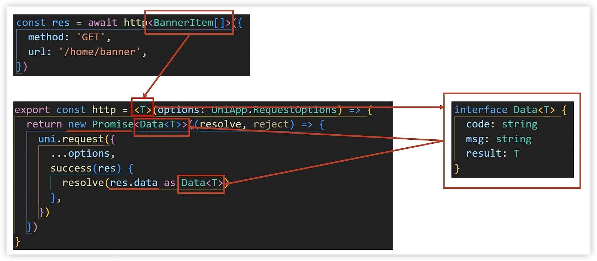

胖达儿
---

参考：https://www.bilibili.com/video/BV1Bp4y1379L

[开发前的准备](prepare.md)


胖达儿包含从首页浏览商品，商品详情，微信登录，加入购物车，提交订单，微信支付，订单管理等功能。

## 1 基础架构

```sh
git clone http://git.itcast.cn/heimaqianduan/erabbit-uni-app-vue3-ts.git  panda-shop
```

在 manifest.json 中添加微信小程序的 appid

```
pnpm install   ->   pnpm dev:mp-weixin    ->   导入微信开发者工具
```


### 工程结构解析


```
├── .husky                     # Git Hooks
├── .vscode                    # VS Code 插件 + 设置
├── dist                       # 打包文件夹（可删除重新打包）
├── src                        # 源代码
│   ├── components             # 全局组件
│   ├── composables            # 组合式函数
│   ├── pages                  # 主包页面
│       ├── index               # 首页
│       ├── category            # 分类页
│       ├── cart                # 购物车
│       ├── my                  # 我的
│       └── login               # 登录页
│   ├── services               # 所有请求
│   ├── static                 # 存放应用引用的本地静态资源的目录
│       ├── images              # 普通图片
│       └── tabs                # tabBar 图片
│   ├── stores                 # 全局 pinia store
│       ├── modules             # 模块
│       └── index.ts            # store 入口
│   ├── styles                 # 全局样式
│       └── fonts.scss          # 字体图标
│   ├── types                  # 类型声明文件
│       └── component.d.ts      # 全局组件类型声明
│   ├── utils                  # 全局方法
│   ├── App.vue                # 入口页面
│   ├── main.ts                # Vue初始化入口文件
│   ├── pages.json             # 配置页面路由等页面类信息
│   ├── manifest.json          # 配置appid等打包信息
│   └── uni.scss               # uni-app 内置的常用样式变量
├── .editorconfig              # editorconfig 配置
├── .eslintrc.cjs              # eslint 配置
├── .prettierrc.json           # prettier 配置
├── .gitignore                 # git 忽略文件
├── index.html                 # H5 端首页
├── package.json               # package.json 依赖
├── tsconfig.json              # typescript 配置
└── vite.config.ts             # vite 配置
```


### 引入uni-ui组件库

[uni-ui 介绍 | uni-app官网](https://uniapp.dcloud.net.cn/component/uniui/uni-ui.html)


安装uni-ui

```
pnpm i @dcloudio/uni-ui
```

通过正则配置uni-ui的组件自动导入：

```json
  // 组件自动引入规则
  "easycom": {
    // 是否开启自动扫描，自动扫描components目录等看是否有符合uniapp的组件
    "autoscan": true,
    // 以正则放到从依赖库中导入组件
    "custom": {
      // uni-ui 规则如下配置
      "^uni-(.*)": "@dcloudio/uni-ui/lib/uni-$1/uni-$1.vue"
    }
  }
```


`@uni-helper/uni-ui-types`作用是提供uni-ui组件类型。安装：

```
pnpm i -D @uni-helper/uni-ui-types
```

配置：

```json
    "types": [

      "@uni-helper/uni-ui-types"
    ]
```

原本：


配置后：


### 小程序端Pinia持久化

状态管理：pinia

持久化在与网页端有所不同：

```js
// 网页端API
localStorage.setItem()
localStorage.getItem()

// 小程序端API
wx.setStorageSync()
wx.getStorageSync()

// 兼容多端API
uni.setStorageSync()
uni.getStorageSync()
```

```json
	persist: {
      storage: {
        getItem(key) {
          return uni.getStorageSync(key)
        },
        setItem(key, val) {
          uni.setStorageSync(key, val)
        },
      },
    },
```


参数的具体配置，可以查看提示中的地址：


### 数据交互（请求工具）

数据交互 -> 请求工具  -> 1️⃣拦截器， 2️⃣请求函数

#### 请求和上传文件拦截器


#### 封装Promise请求函数

目的是为了更加方便的发请求。借鉴aioxs


##### 请求成功提取数据和设置类型




##### 获取数据失败

- uni.request 的 success 回调函数只是表示服务器**响应成功，没处理响应状态码**，业务中使用不方便

- axios 函数是只有**响应状态码**是 2xx 才调用 **resolve 函数，表示获取数据成功**，业务中使用更准确


模拟网络失败


## 2 首页模块


### 2.1 自定义导航栏

1. 准备组件
2. 隐藏默认导航栏，修改文字颜色
3. 样式适配-> ==安全区域==


### 2.2 通用轮播组件

总共有两处广告位，分别位于【首页】和【商品分类页】。

轮播图组件需要在首页和分类页使用，需要封装成通用组件。

1. 准备组件
2. 自动导入组件
3. 添加组件类型声明


```json
"easycom": {
    // 是否开启自动扫描，自动扫描components目录等看是否有符合uniapp的组件
    "autoscan": true,
    // 以正则放到从依赖库中导入组件
    "custom": {
      // uni-ui 规则如下配置
      "^uni-(.*)": "@dcloudio/uni-ui/lib/uni-$1/uni-$1.vue",
      // 在通用组件文件夹中，查找以Pd开头的组件，自动导入(修改后需要重启服务器)
      "^Pd(.*)": "@/components/Pd$1.vue"
    }
  }
```

```typescript
import PdSwiper from './PdSwiper.vue'

// 定义全局类型
declare module '@vue/runtime-core' {
  export interface GlobalComponents {
    PdSwiper: typeof PdSwiper
  }
}
```


#### 轮播图指示点


知识点：
1. `UniHelper` 提供事件类型
2. `？`(可选链) 允许前面表达式为空值
3. `！`(非空断言) 主观上排除掉空值情况

#### 获取轮播图数据

1. 封装获取轮播图数据API
2. 页面初始化调用API

```js
// services/home.ts
export const getHomeBannerAPI = (distributionSite = 1) => {
  return http({
    method: 'GET',
    url: '/home/banner',
    data: {
    	distributionSite,
    },
  })
}
```

```js
// pages/index/index.vue
const getHomeBannerData = async () => {
  const res = await getHomeBannerAPI()
  console.log(res)
}
onLoad(() => {
  getHomeBannerData()
})
```


#### 定义轮播图数据类型并渲染

1. 定义轮播图数据类型  `types/home.d.ts`
2. 指定类型并传值给子组件
3. 渲染轮播图数据


#### 轮播图总结


> bug  
>
> `[plugin:uni:mp-using-component] Unexpected token C in JSON at position 33`
>
> 解决方案：https://github.com/dcloudio/uni-app/issues/4952


### 2.3 前台分类组件


1. 准备组件（只有首页使用，存放到首页的 `components` ，取名 `CategoryPanel`）
2. 导入并使用组件
3. 设置首页底色为  `#F7F7F7`  

小程序页面根标签是`<page>`，类似web种的body


#### 获取前台分类数据

1. 封装获取前台分类数据API
2. 页面初始化调用API

```ts
// services/home.ts
export const getHomeCategoryAPI = () => {
  return http({
    method: 'GET',
    url: '/home/category/mutli',
  })
}
```

```typescript
// pages/index/index.vue
const getHomeCategoryData = async () => {
  const res = await getHomeCategoryAPI()
}
onLoad(() => {
	getHomeCategoryData()
})
```


#### 前台分类数据类型并渲染

1. 定义前台分类数据类型
2. 指定类型并传值给子组件
3. 渲染前台分类数据


### 2.4 热门推荐组件

1. 准备组件(只有首页使用)
2. 导入并使用组件


#### 获取热门推荐数据

1. 封装获取热门推荐数据API
2. 页面初始化调用API

#### 热门推荐数据类型并渲染

1. 定义热门推荐数据类型
2. 指定类型并传值给子组件
3. 渲染热门推荐数据


### 猜你喜欢组件


### 下拉刷新


### 骨架屏


> 

> 推荐模块 + 分类模块 + 详情模块


## 3 推荐模块


## 4 分类模块


## 5 详情模块


## 6 登录模块


## 7 用户模块


## 8 地址管理


## 9 SKU模块


## 10 购物车模块


## 11 订单模块


## 项目打包