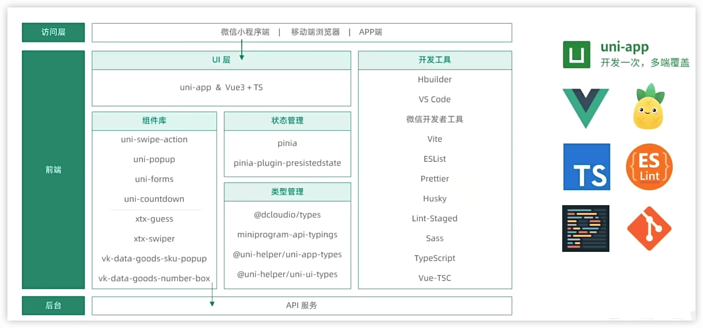
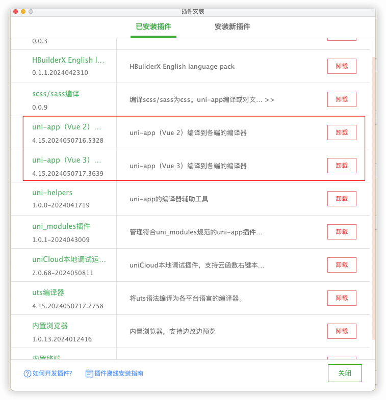
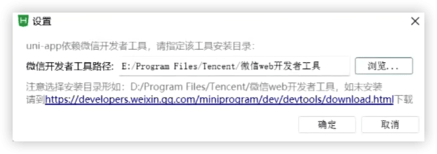
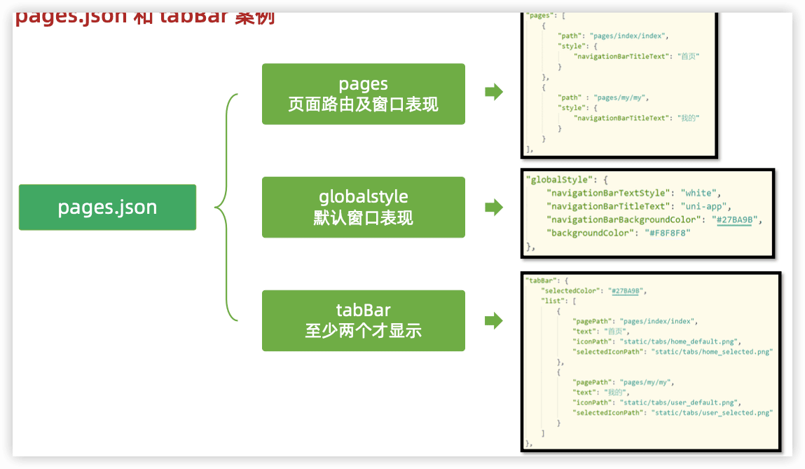
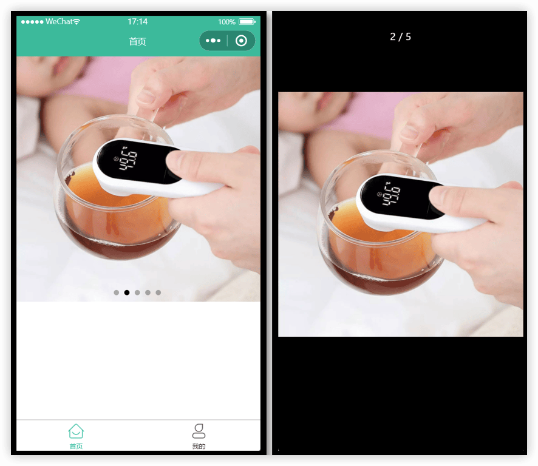
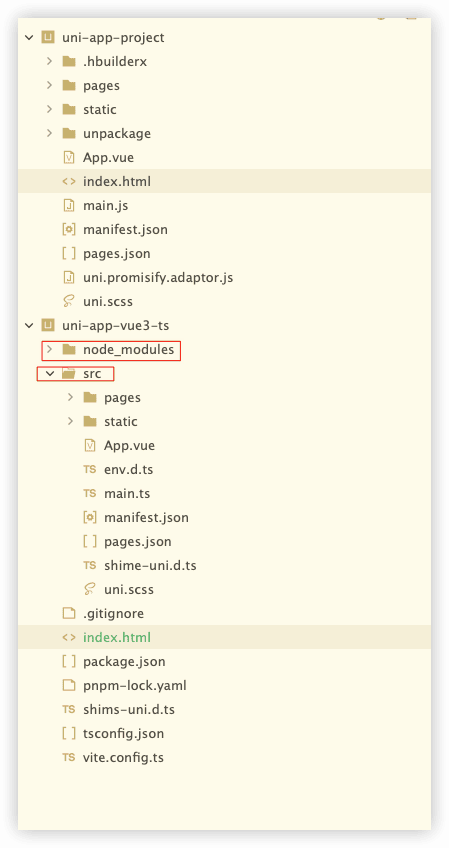
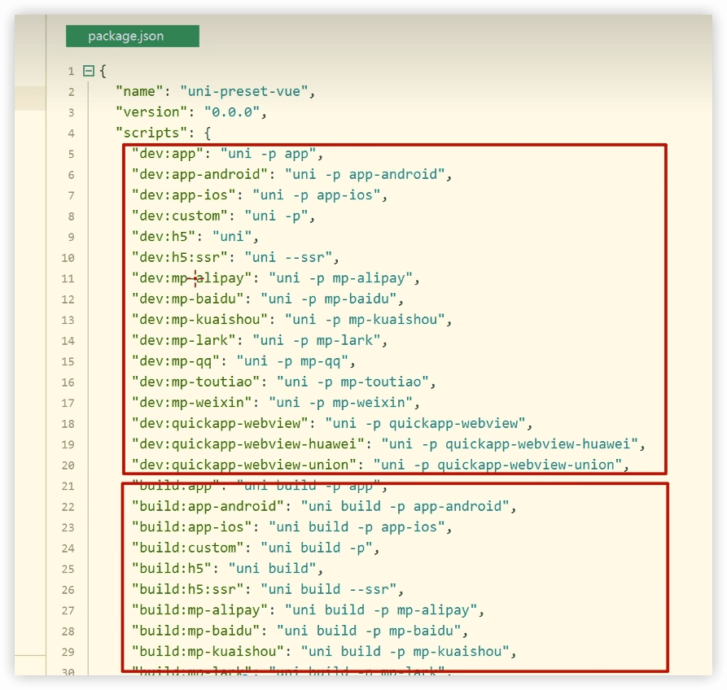
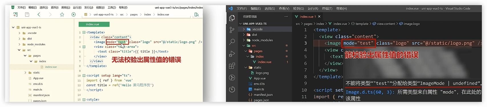
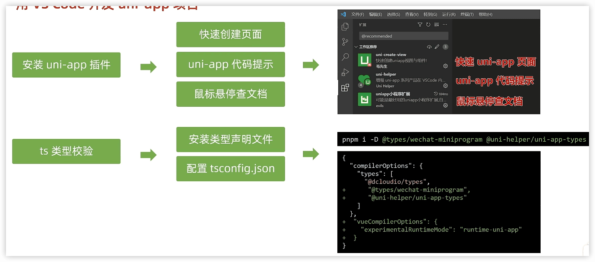
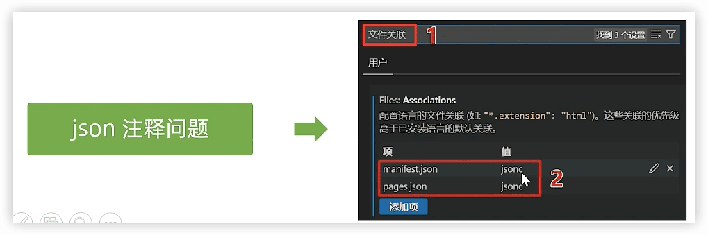

开发准备
----


参考：https://www.bilibili.com/video/BV1Bp4y1379L

https://gitee.com/Megasu/uniapp-shop-vue3-ts/

接口文档：https://www.apifox.cn/apidoc/shared-0e6ee326-d646-41bd-9214-29dbf47648fa/


### 技术架构



### 适合人群

1. 已经学过原生小程序，想要进阶 uni-app技术栈的小伙伴
2. 想要一套代码，同时覆盖小程序、H5、App 多端
3. 学过 Vue3+ TS 基础，但是苦于没有项目练手的小伙伴
4. 想要做小程序毕业设计的小伙伴
5. 想要了解 uni-app 技术栈的后端开发小伙伴


### 创建uni-app项目

两种方式：

1. 通过HBuilderX 创建

HBuildeX和微信开发者工具关系：


HBuilderX需要安装Vue编译插件，才能把项目编译成小程序带代码。



选择微信开发者工具的安装目录：


打开微信开发者工具的服务端口。


2. 通过命令行创建（需安装 NodeJS 环境）


### pages.json和tabBar案例

 uni-app项目的目录结构：

```
├─pages            业务页面文件存放的目录
│  └─index
│     └─index.vue  index页面
├─static           存放应用引用的本地静态资源的目录(注意：静态资源只能存放于此)
├─unpackage        非工程代码，一般存放运行或发行的编译结果
├─index.html       H5端页面
├─main.js          Vue初始化入口文件
├─App.vue          配置App全局样式、监听应用生命周期
├─pages.json       配置页面路由、导航栏、tabBar等页面类信息
├─manifest.json    配置appid**、应用名称、logo、版本等打包信息
└─uni.scss         uni-app内置的常用样式变量
```





🔖 小程序注册


### uni-app和原生小程序开发区别

#### 开发区别

uni-app项目每个页面是一个`.vue`文件，**数据绑定及事件处理同`Vue.js`规范**：

1. 属性绑定：原生`src="{{url}}"` 升级成 `:src="url"`

2. 事件绑定：原生`bindtap="eventName"` 升级成 `@tap="eventName"`，**支持()传参**

3. 支持Vue常用**指令** `v-for`、`v-if`、`v-show`、`v-model` 等

#### 其他区别补充

1. 调用接口能力，**建议前缀** `wx` 替换为 `uni` ，养成好习惯，**支持多端开发**。
2. `<style>` 页面样式不需要写 `scoped`，小程序是多页面应用，**页面样式自动隔离**。
3. **生命周期分三部分**：应用生命周期(小程序)，页面生命周期(小程序)，组件生命周期(Vue)


> 温馨提示：调用接口能力，建议前缀wx替换为 uni ，养成好习惯，这样支持多端开发。

#### 案例练习

1.  滑动轮播图
2.  点击大图预览

swiper.vue




### 命令行创建uni-app项目

优势：**不必依赖HBuilderX，TypeScript类型支持友好**。


vue3+js版：

```
npx degit dcloudio/uni-preset-vue#vite 项目名称
```

vue3+ts版: 

```
npx degit dcloudio/uni-preset-vue#vite-ts 项目名称
```

- `npx`是安装node自带的工具
- `npx degit` 是一个用于快速克隆 Git 仓库的工具
- `dcloudio/uni-preset-vue`是仓库的地址
- 井号后面表示某个分支


也可以：

```sh
# 通过 git 从 gitee 克隆下载 (👉备用地址)
git clone -b vite-ts https://gitee.com/dcloud/uni-preset-vue.git
```

创建项目：

```
npx degit dcloudio/uni-preset-vue#vite-ts uni-app-vue3-ts
```

通过pnpm下载相关依赖【包括uniapp编译器】

```
pnpm i
```



src就对应用HBuilderX创建的uniapp项目中的文件结构。




开发时用dev（修改一个文件就更新一下），发布时用build（压缩，但不会监听文件的变化）

- `pnpm dev:mp-weixin`  编译成微信小程序代码，在项目中生成`dist/`目录

- 打开微信开发者工具, 导入 `dist/dev/mp-weixin` 运行


编译和运行uni-app项目过程总结：


> 编译成 H5 端可运行 `pnpm dev:h5` 通过浏览器预览项目。


### 用VS Code开发uni-app项目

#### 为什么选择vs code

HBuilderX对TS类型支持暂时不完善




#### 用VS Code开发前配置



- 👉 前置工作：安装 Vue3 插件，[点击查看官方文档](https://cn.vuejs.org/guide/typescript/overview.html#ide-support)
  - 安装 **Vue Language Features (Volar)** ：Vue3 语法提示插件
  - 安装 **TypeScript Vue Plugin (Volar)** ：Vue3+TS 插件
  - **工作区禁用** Vue2 的 Vetur 插件(Vue3 插件和 Vue2 冲突)
  - **工作区禁用** @builtin typescript 插件（禁用后开启 Vue3 的 TS 托管模式）
- 👉 安装 uni-app 开发插件
  - **uni-create-view** ：快速创建 uni-app 页面
  - **uni-helper uni-app** ：代码提示
  - **uniapp 小程序扩展** ：鼠标悬停查文档
- 👉 TS 类型校验
  - 安装 **类型声明文件** `pnpm i -D miniprogram-api-typings @uni-helper/uni-app-types`
  - 配置 `tsconfig.json`


`tsconfig.json` 参考

```json {11,12,14-15,18-22}
// tsconfig.json
{
  "extends": "@vue/tsconfig/tsconfig.json",
  "compilerOptions": {
    "sourceMap": true,
    "baseUrl": ".",
    "paths": {
      "@/*": ["./src/*"]
    },
    "lib": ["esnext", "dom"],
    // 类型声明文件
    "types": [
      "@dcloudio/types", // uni-app API 类型
      "miniprogram-api-typings", // 原生微信小程序类型
      "@uni-helper/uni-app-types" // uni-app 组件类型
    ]
  },
  // vue 编译器类型，校验标签类型
  "vueCompilerOptions": {
    // 原配置 `experimentalRuntimeMode` 现调整为 `nativeTags`
    "nativeTags": ["block", "component", "template", "slot"], // [!code ++]
    "experimentalRuntimeMode": "runtime-uni-app" // [!code --]
  },
  "include": ["src/**/*.ts", "src/**/*.d.ts", "src/**/*.tsx", "src/**/*.vue"]
}
```

danger 版本升级

- 原依赖 `@types/wechat-miniprogram` 现调整为 [miniprogram-api-typings](https://github.com/wechat-miniprogram/api-typings)。
- 原配置 `experimentalRuntimeMode` 现调整为 `nativeTags`。


这一步处理很关键，否则 TS 项目无法校验组件属性类型。


- 👉 JSON 注释问题

默认是不可以在JSON文件中注释的。

设置文件关联，把 `manifest.json` 和 `pages.json` 设置为 `jsonc`，就可以在这两个文件中注释了。




> 提醒：在uniapp里只有`manifest.json`和`pages.json`两个json文件里可以写注释。

**工作区设置参考**

```json
// .vscode/settings.json
{
  // 在保存时格式化文件
  "editor.formatOnSave": true,
  // 文件格式化配置
  "[json]": {
    "editor.defaultFormatter": "esbenp.prettier-vscode"
  },
  // 配置语言的文件关联
  "files.associations": {
    "pages.json": "jsonc", // pages.json 可以写注释
    "manifest.json": "jsonc" // manifest.json 可以写注释
  }
}
```


VS Code和微信开发者工具关系：


`pnpm dev:mp-weixin`


#### 用VS Code开发练习

使用 `VS Code` 编辑器写代码，实现 tabBar 案例 + 轮播图案例。


## 开发记录

bugs

- [ ] elint缩进
- [ ] vscode ts代码类型提醒
- [ ] css flex属性 `flex: 1;`
- [ ] easycom 组件不能自动导入
- [ ] 新增地址接口报错
- [ ] 地址管理表单验证没有
- [ ] 滑动删除地址 
- [ ] 购物车列表滑动删除样式
- [ ] pages/Order/list   支付
- [ ] 首页分类跳转

 


