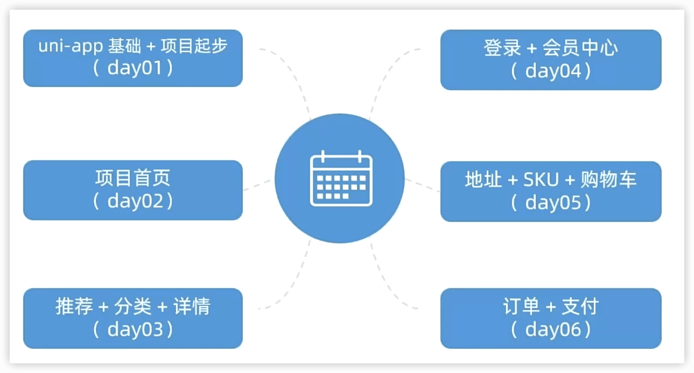
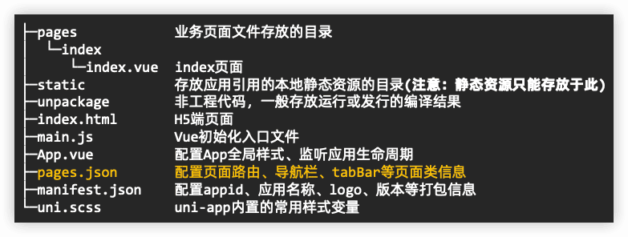

https://www.bilibili.com/video/BV1Bp4y1379L

https://gitee.com/Megasu/uniapp-shop-vue3-ts/

 

前言

### 技术架构

### 课程安排

day1

### 创建 uni-app 项目

通过 HBuilderX 创建

### pages.json 和 tabBar 案例

🔖 小程序注册

### uni-app和原生小程序开发区别

> 温馨提示：调用接口能力，建议前缀 wx 替换为 uni ，养成好习惯，这样支持多端开发。

### 命令行创建 uni-app 项目

不必依赖HBuilderX

vue3+ts版: `npx degit dcloudio/uni-preset-vue#vite-ts 项目名称`

https://uniapp.dcloud.net.cn/quickstart-cli.html

编译和运行 uni-app 项目：

- `pnpm i`

开发时用dev，发布时用build

- `pnpm dev:mp-weixin`  编译成微信小程序代码，在项目中生成`dist/`目录

- 打开 微信开发者工具, 导入 `dist/dev/mp-weixin` 运行

### 用 VS Code 开发 uni-app 项目

`pnpm i -D @types/wechat-miniprogram @uni-helper/uni-app-types`

> 提醒：在uniapp里只有`manifest.json`和`pages.json`两个json文件里可以写注释。

🔖 P6 问题 ts验证
